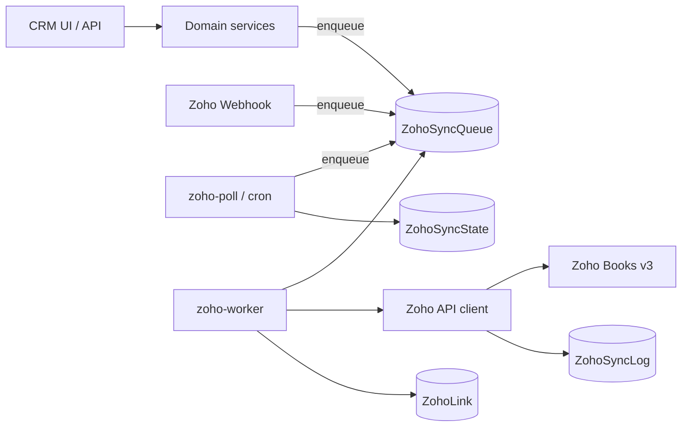
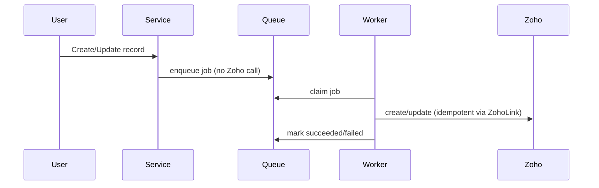

# Zoho Books ↔ VayuGuard CRM Integration

End-to-end integration so CRM customers, quotations (estimates), invoices, and payments sync with Zoho Books. Designed for India GST orgs, background-only Zoho calls, and safe defaults (`ZOHO_SYNC_ENABLED=false`).

---

## 1. Overview & architecture



**Ownership**

| Concern | Owner |
|---|---|
| Customer create/update, invoice create | CRM |
| Payment status / balance / tax calculation | Zoho |
| Id mapping | `ZohoLink` |
| Runtime sync on/off | Env + DB override (`sync_enabled`) |

---

## 2. Project findings

| Area | Finding |
|---|---|
| Stack | Next.js 15 App Router, TypeScript, Prisma 6, PostgreSQL |
| Auth | Auth.js (NextAuth) JWT; permissions via `settings:read/write` for admin Zoho UI |
| Queues | No Redis/Bull — **DB-backed** `ZohoSyncQueue` + `tsx` worker process |
| Customers | `src/server/services/customers.service.ts` |
| Quotations | `src/server/services/quotations.service.ts` |
| Invoices / payments | `src/server/services/invoices.service.ts` |
| GST already present | `Customer.gstNumber`, additive `gstTreatment`, `placeOfSupply`; `Product.hsnSac` |
| Config | `.env` / `.env.example`; no separate config framework |

### Folder structure

```
src/server/integrations/zoho/
  config.ts           # DC URLs, env helpers
  sync-enabled.ts     # env + DB override
  token.ts            # OAuth access token cache/refresh
  client.ts           # Books API + retries/rate limit/logging
  rate-limit.ts
  errors.ts
  redact.ts
  queue.ts            # enqueue + ZohoLink + sync state
  triggers.ts         # fire-and-forget enqueue helpers
  worker.ts           # batch processor + loop
  mappers/            # pure CRM → Zoho mappers + GST
  jobs/               # sync-*, pull-updates, process-webhook
src/app/api/webhooks/zoho/route.ts
src/app/api/zoho/{status,actions,link}/route.ts
src/features/zoho/    # Admin UI + per-record sync badge
scripts/zoho-*.ts     # CLI: worker, poll, exchange, test, migrate
```

---

## 3. Environment variables

| Name | Meaning | Example |
|---|---|---|
| `ZOHO_DC` | Data center | `in` |
| `ZOHO_CLIENT_ID` | Self Client id | *(from API Console)* |
| `ZOHO_CLIENT_SECRET` | Self Client secret | |
| `ZOHO_REFRESH_TOKEN` | Long-lived refresh token | *(from grant exchange)* |
| `ZOHO_ORGANIZATION_ID` | Books org id | |
| `ZOHO_WEBHOOK_SECRET` | Shared secret header for webhooks | random string |
| `ZOHO_SYNC_ENABLED` | Master env flag (default **false**) | `false` |
| `ZOHO_RATE_LIMIT_PER_MIN` | Soft client limit | `90` |
| `ZOHO_WORKER_INTERVAL_MS` | Worker poll interval | `5000` |

**Fill these in your real `.env` yourself — never paste secrets in chat.**

---

## 4. Credentials & refresh token

1. Zoho API Console → `https://api-console.zoho.<dc>` → **Self Client**.
2. Generate grant code (≈10 min) with scopes:
   `ZohoBooks.contacts.ALL,ZohoBooks.invoices.ALL,ZohoBooks.estimates.ALL,ZohoBooks.customerpayments.ALL,ZohoBooks.settings.READ`
3. Exchange:
   ```bash
   npx tsx scripts/zoho-exchange-token.ts <GRANT_CODE>
   ```
4. Put printed refresh token into `ZOHO_REFRESH_TOKEN`.
5. Test:
   ```bash
   npm run zoho:test
   ```
6. Rotate: revoke old token in Zoho console, generate a new grant, repeat.

---

## 5. Mapping table (CRM → Zoho)

| CRM | Zoho Books |
|---|---|
| Customer | Contact (`contact_type: customer`) |
| Quotation | Estimate |
| Invoice + lines | Invoice |
| Payment | Customer Payment (applied to invoice) |

### Customer fields

| CRM | Zoho |
|---|---|
| name | contact_name |
| legalName | company_name |
| email / phone | email / phone |
| gstNumber | gst_no |
| gstTreatment / inferred | gst_treatment |
| placeOfSupply / state / GSTIN prefix | place_of_supply |
| billing* / shipping* | billing_address / shipping_address |

### Invoice fields

| CRM | Zoho |
|---|---|
| invoiceNumber | invoice_number |
| issueDate / dueDate | date / due_date |
| line description, qty, rate, discount, tax% | line_items |
| product.hsnSac | hsn_or_sac |

### GST notes

- GSTIN validated as 15-char Indian format when present.
- Default place of supply falls back to Maharashtra `27` if unknown (**assumption** for VayuGuard India org).
- Line taxes sent as `tax_percentage` (**assumption**: Zoho org accepts percentage-based lines).

---

## 6. Sync flows

### CRM → Zoho



Order: customer → invoice → payment. Missing dependency → re-enqueue with delay.

### Zoho → CRM

1. **Webhook** `POST /api/webhooks/zoho` with header `X-Zoho-Webhook-Secret`.
2. **Polling** every ~10 minutes via `npm run zoho:poll` (or cron / queued `pull_updates`).
3. Never overwrite with older Zoho `last_modified` than `ZohoLink.zohoLastModified`.

---

## 7. Database tables added (additive)

- `ZohoLink` — CRM ↔ Zoho ids
- `ZohoSyncLog` — redacted request/response audit
- `ZohoSyncState` — poll cursors + `sync_enabled` override
- `ZohoSyncQueue` — background jobs
- `ZohoTokenCache` — access token cache
- Optional columns: `Customer.gstTreatment`, `Customer.placeOfSupply`, `Product.hsnSac`

---

## 8. Commands

```bash
# Schema
npx prisma generate
npx prisma db push

# Unit tests
npm test

# Connection
npm run zoho:test

# Worker (PM2/systemd long-running)
npm run zoho:worker

# Poll once
npm run zoho:poll

# Initial migration
npm run zoho:migrate:dry
npm run zoho:migrate:apply
# optional open invoices: npx tsx scripts/zoho-migrate.ts --apply --invoices
```

Worker must run in production whenever sync is enabled.

---

## 9. Webhook setup (Zoho Books)

1. Zoho Books → **Settings → Automation → Workflow Rules / Webhooks**.
2. URL: `https://<your-domain>/api/webhooks/zoho`
3. Method: `POST`
4. Custom header: `X-Zoho-Webhook-Secret: <same as ZOHO_WEBHOOK_SECRET>`
5. Trigger on Invoice updated / Customer Payment created|updated.
6. Confirm CRM returns `200` quickly; work is queued.

---

## 10. Troubleshooting

| Symptom | Action |
|---|---|
| Jobs stay pending | Start `npm run zoho:worker` |
| Auth errors | Re-run grant exchange; check scopes/org |
| 429s | Lower `ZOHO_RATE_LIMIT_PER_MIN`; worker backs off |
| Duplicate contacts | Migration marks duplicates; resolve in Zoho, then link manually |
| Failed jobs | Admin → Zoho Sync → Retry / Retry all |
| Kill switch | Toggle Sync off in UI or set `ZOHO_SYNC_ENABLED=false` |

---

## 11. Manual sandbox checklist

1. [ ] Fill sandbox credentials in `.env` (`ZOHO_SYNC_ENABLED=false` first)
2. [ ] `npm run zoho:test` → OK
3. [ ] `npm run zoho:migrate:dry` → review CSV under `tmp/`
4. [ ] Enable sync (UI toggle or env `true`)
5. [ ] Start worker
6. [ ] Create customer with GSTIN → appears in Zoho; `ZohoLink` row exists
7. [ ] Create invoice → Zoho invoice created
8. [ ] Record payment in CRM → Zoho customer payment
9. [ ] Change payment/balance in Zoho → webhook or poll updates CRM
10. [ ] Wrong webhook secret → 401
11. [ ] Disable sync → no new outbound jobs

---

## 12. Go-live checklist

1. Point credentials at **production** Zoho org (new refresh token).
2. Dry-run migration; fix duplicates/conflicts.
3. Apply migration for customers; optionally invoices.
4. Set `ZOHO_SYNC_ENABLED=true` (or admin toggle).
5. Run worker + 10-minute poll cron.
6. Configure production webhook URL + secret.
7. Sync 5–10 real records; watch Admin Zoho Sync + `ZohoSyncLog` for a week.
8. Add alert on dead-letter queue count (optional ops).

---

## 13. Rollback

1. Set sync **off** (admin toggle or `ZOHO_SYNC_ENABLED=false`).
2. Stop worker / poll cron.
3. Links and logs remain (non-destructive). CRM continues without Zoho.

---

## 14. Assumptions & decisions (no ask)

1. Zoho Books REST paths under `/books/v3` (`/contacts`, `/estimates`, `/invoices`, `/customerpayments`) — official docs were not fetchable (403); paths are standard Books API.
2. Write APIs use form field `JSONString` (Zoho convention).
3. Default `place_of_supply` = `27` (Maharashtra) when unresolved.
4. Line tax via `tax_percentage` rather than pre-resolved Zoho tax IDs.
5. DB-backed queue instead of Redis (project had no queue infra).
6. Admin sync toggle stored in `ZohoSyncState.sync_enabled` (env alone cannot be toggled from Next.js UI reliably).
7. Payments are create-only in Zoho (no update).
8. Unknown Zoho invoices (no `ZohoLink`) are ignored on inbound sync — CRM owns invoice creation.
9. `scripts/zoho-*.ts` tracked via gitignore exceptions; other `/scripts` remain ignored.
10. Unit tests mock `fetch` / Prisma; no live Zoho calls in CI.

---

## Security review notes

- Secrets only from env; never logged (redactor strips tokens).
- Webhook requires shared secret header.
- Sync log stores redacted JSON only.
- No Zoho calls on the request path (enqueue only).
- Idempotent creates via `ZohoLink` + contact search by email/GSTIN.
